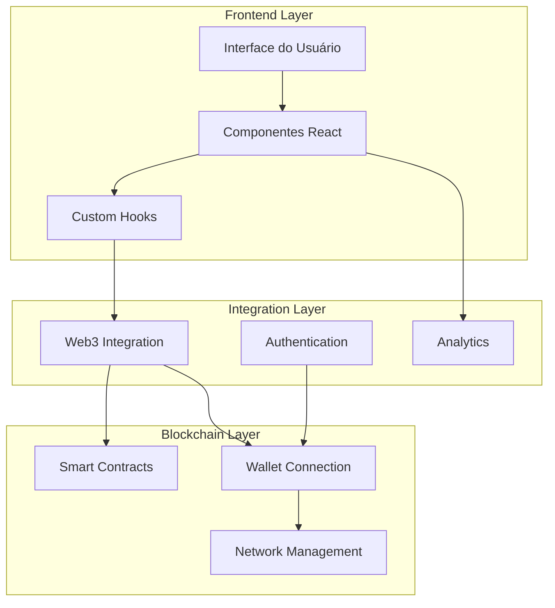
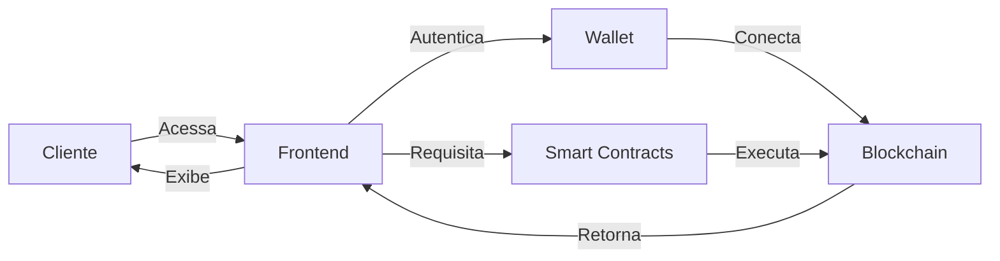
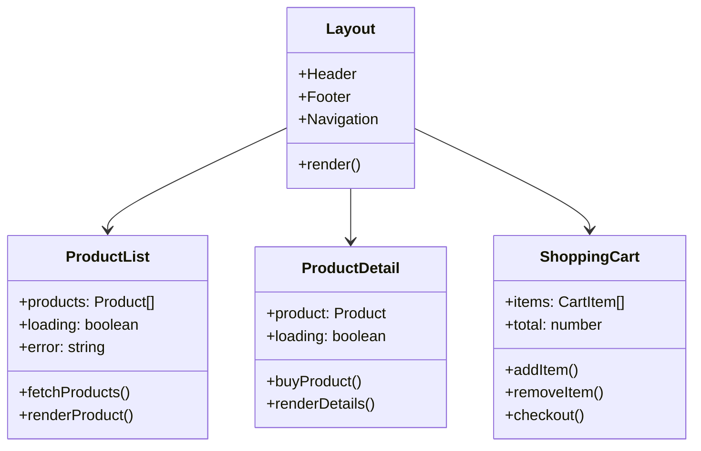
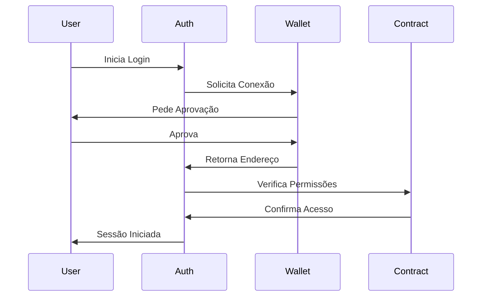
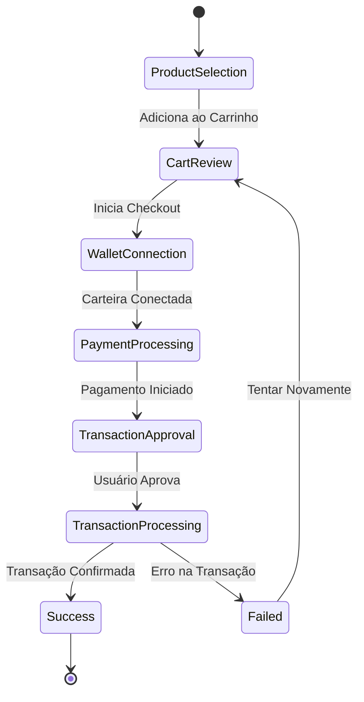
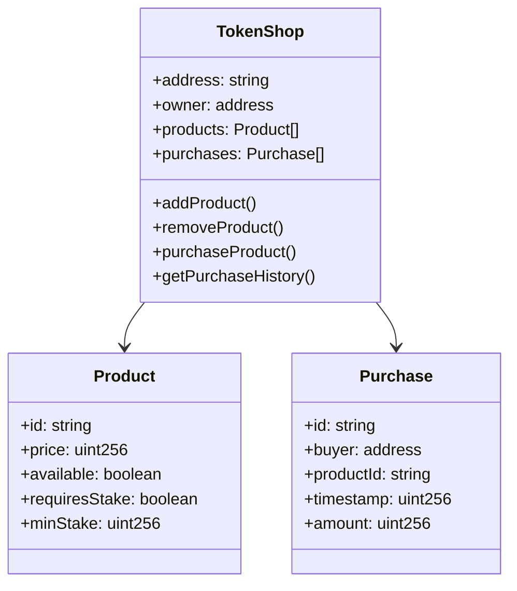
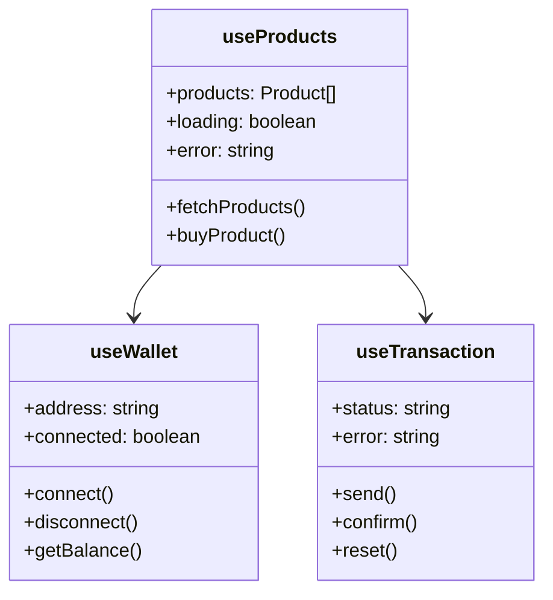

# Documentação de Arquitetura - Token Shop

## 1. Visão Macro do Sistema

### 1.1 Arquitetura Geral

Este diagrama representa a arquitetura em três camadas do sistema, mostrando as principais responsabilidades e interações entre os componentes.



**Explicação dos Componentes:**

1. **Frontend Layer**
   - `UI`: Ponto de entrada da aplicação, responsável pela apresentação visual
   - `Components`: Componentes React reutilizáveis que formam a interface
   - `Hooks`: Lógica de negócio encapsulada em hooks personalizados

2. **Integration Layer**
   - `Web3`: Ponte entre frontend e blockchain, gerencia interações com smart contracts
   - `Auth`: Sistema de autenticação baseado em carteiras Web3
   - `Analytics`: Coleta e análise de dados de uso

3. **Blockchain Layer**
   - `Smart`: Contratos inteligentes que executam a lógica de negócio na blockchain
   - `Wallet`: Gerenciamento de conexão com carteiras digitais
   - `Network`: Configuração e gestão de conexões com diferentes redes

### 1.2 Fluxo de Dados Principal

Este diagrama ilustra o fluxo principal de dados na aplicação, desde a interação do usuário até a execução na blockchain.



**Detalhamento do Fluxo:**

1. Cliente acessa a aplicação através do frontend
2. Frontend solicita autenticação via carteira
3. Carteira estabelece conexão com a blockchain
4. Frontend faz requisições aos smart contracts
5. Smart contracts executam operações na blockchain
6. Resultados são retornados ao frontend
7. Frontend atualiza a interface do usuário

## 2. Diagramas Micro

### 2.1 Componentes da Interface

Este diagrama mostra a estrutura dos principais componentes React e suas relações.



**Descrição dos Componentes:**

1. **Layout**
   - Componente principal que define a estrutura da página
   - Gerencia elementos comuns como header, footer e navegação
   - Organiza a disposição dos componentes filhos

2. **ProductList**
   - Lista os produtos disponíveis para compra
   - Gerencia estados de carregamento e erro
   - Implementa paginação e filtragem

3. **ProductDetail**
   - Exibe informações detalhadas de um produto
   - Gerencia o processo de compra
   - Mostra status de disponibilidade e preço

4. **ShoppingCart**
   - Gerencia itens no carrinho
   - Calcula totais e aplica regras de negócio
   - Processa checkout

### 2.2 Sistema de Autenticação

Este diagrama sequencial mostra o processo de autenticação do usuário.



**Etapas do Processo:**

1. Usuário inicia o processo de login
2. Sistema de autenticação solicita conexão com a carteira
3. Carteira solicita aprovação do usuário
4. Usuário aprova a conexão
5. Carteira retorna o endereço do usuário
6. Sistema verifica permissões no contrato
7. Contrato confirma acesso
8. Usuário recebe confirmação de sessão iniciada

### 2.3 Processo de Compra Detalhado

Este diagrama de estado mostra as diferentes etapas do processo de compra.



**Estados e Transições:**

1. **ProductSelection**
   - Usuário navega e seleciona produtos
   - Pode visualizar detalhes e preços

2. **CartReview**
   - Revisão dos itens selecionados
   - Confirmação de quantidades e valores

3. **WalletConnection**
   - Verificação de conexão com carteira
   - Validação de saldo

4. **PaymentProcessing**
   - Preparação da transação
   - Cálculo de gas fees

5. **TransactionApproval**
   - Aguarda aprovação do usuário
   - Mostra detalhes da transação

6. **TransactionProcessing**
   - Execução da transação na blockchain
   - Monitoramento de status

7. **Success/Failed**
   - Confirmação ou erro da transação
   - Opções de retry em caso de falha

### 2.4 Estrutura de Smart Contracts

Este diagrama mostra a estrutura dos contratos inteligentes e suas relações.



**Detalhamento dos Contratos:**

1. **TokenShop**
   - Contrato principal da aplicação
   - Gerencia produtos e compras
   - Controla permissões e propriedade

2. **Product**
   - Define estrutura dos produtos
   - Gerencia preços e disponibilidade
   - Implementa regras de stake

3. **Purchase**
   - Registra histórico de compras
   - Mantém dados das transações
   - Permite rastreamento

### 2.5 Sistema de Hooks

Este diagrama mostra a estrutura dos hooks personalizados e suas dependências.



**Funcionalidades dos Hooks:**

1. **useWallet**
   - Gerencia conexão com carteira
   - Mantém estado de conexão
   - Fornece métodos de interação

2. **useProducts**
   - Gerencia lista de produtos
   - Implementa operações de compra
   - Controla estados de loading

3. **useTransaction**
   - Gerencia transações
   - Monitora status
   - Trata erros

## 3. Descrições Detalhadas

### 3.1 Camadas do Sistema

1. **Frontend Layer**
   - Interface do usuário em React/Next.js
   - Componentes reutilizáveis
   - Gerenciamento de estado
   - Hooks personalizados

2. **Integration Layer**
   - Integração Web3
   - Sistema de autenticação
   - Analytics e monitoramento
   - Gerenciamento de carteira

3. **Blockchain Layer**
   - Smart Contracts
   - Conexão com rede
   - Gerenciamento de transações
   - Validação de dados

### 3.2 Fluxos Principais

1. **Autenticação**
   - Conexão de carteira
   - Verificação de permissões
   - Gestão de sessão

2. **Compra de Produtos**
   - Seleção de produtos
   - Verificação de saldo
   - Processamento de pagamento
   - Confirmação de transação

3. **Gestão de Produtos**
   - Listagem de produtos
   - Detalhes do produto
   - Histórico de compras
   - Status de transações

### 3.3 Considerações Técnicas

1. **Segurança**
   - Validação de transações
   - Proteção contra ataques
   - Gestão de chaves privadas
   - Verificação de assinaturas

2. **Performance**
   - Otimização de gas
   - Caching de dados
   - Lazy loading
   - Otimização de renders

3. **Escalabilidade**
   - Arquitetura modular
   - Componentes reutilizáveis
   - Separação de responsabilidades
   - Padrões de design

## 4. Padrões e Convenções

### 4.1 Padrões de Código

- Clean Architecture
- SOLID Principles
- React Best Practices
- Smart Contract Patterns

### 4.2 Convenções de Nomenclatura

- Camel Case para variáveis e funções
- Pascal Case para componentes
- Kebab Case para arquivos
- Prefixos específicos para tipos

### 4.3 Estrutura de Diretórios

```
src/
├── components/
│   ├── common/
│   ├── product/
│   └── wallet/
├── hooks/
│   ├── useWallet.ts
│   └── useProducts.ts
├── contracts/
│   ├── TokenShop.sol
│   └── interfaces/
├── utils/
│   ├── web3.ts
│   └── validation.ts
└── types/
    ├── product.ts
    └── transaction.ts
```
