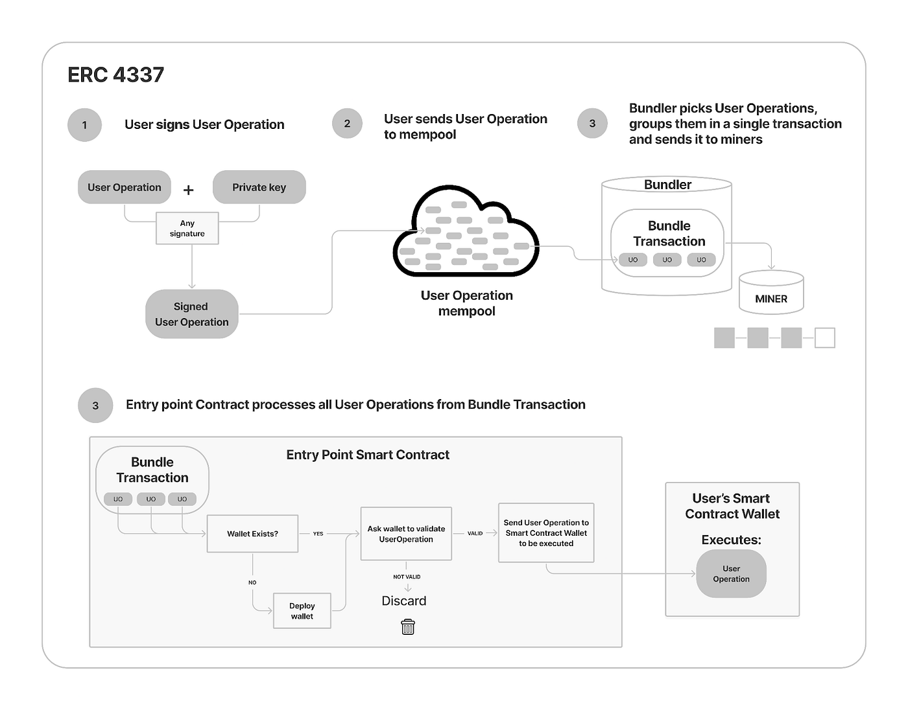
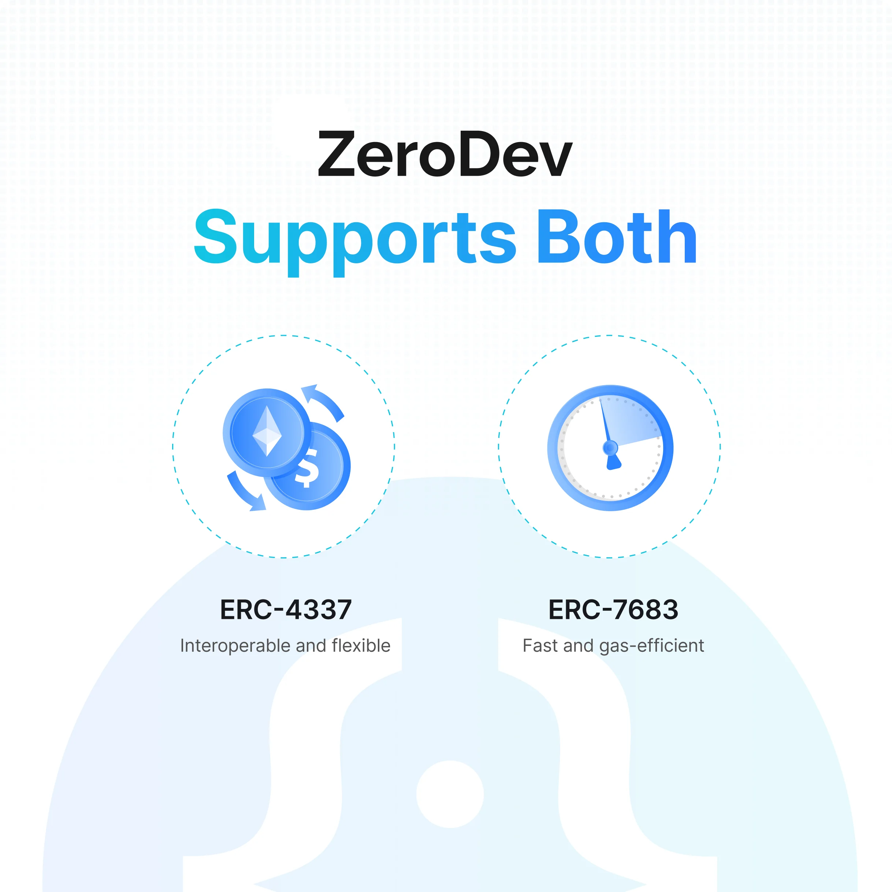
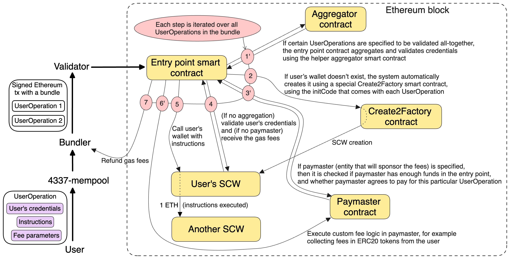
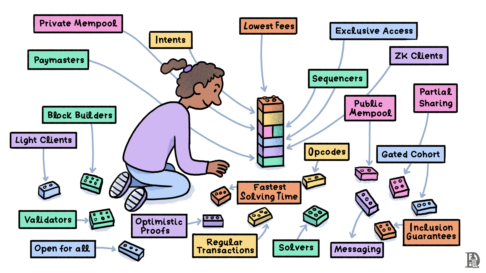
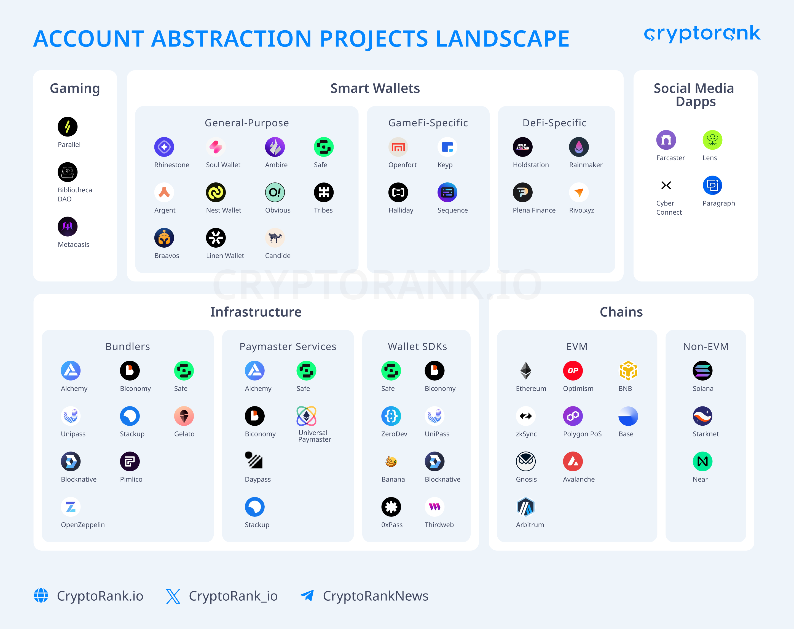
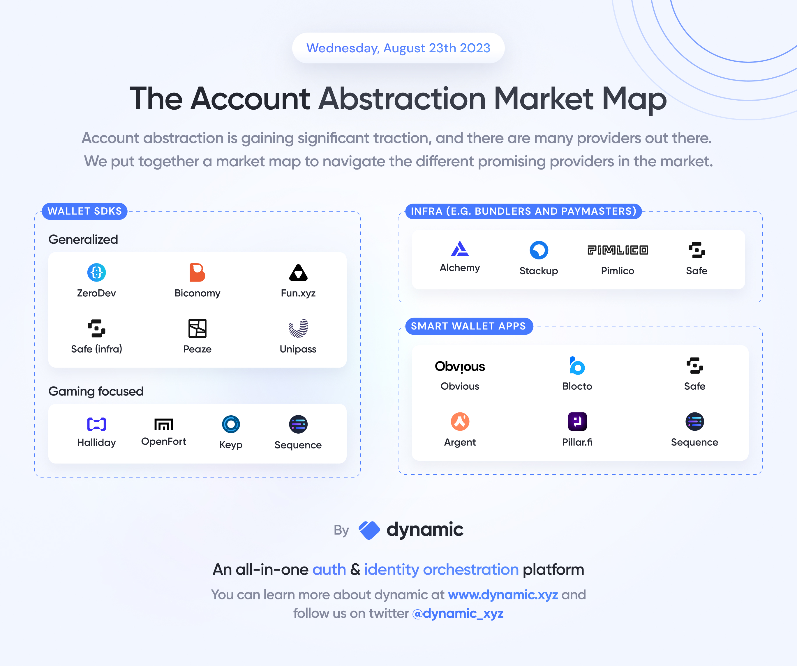

# 🚀 ZeroDev Token Shop

 yarn install
 

Um marketplace moderno e acessível para tokens digitais únicos, construído com Next.js, TypeScript e Tailwind CSS.


*Account Abstraction: A evolução da experiência Web3 - simplificando a interação do usuário com blockchain*

## ✨ Características Principais

- **🔗 Integração Web3**: Conecte sua carteira MetaMask para comprar tokens
- **🎨 Design Glassmorphism**: Interface moderna com efeitos de vidro e gradientes
- **📱 Totalmente Responsivo**: Experiência perfeita em todas as telas (320px - 1920px+)
- **♿ Acessível**: Compatível com WCAG 2.1 AA, navegação por teclado e leitores de tela
- **⚡ Performance Otimizada**: Lazy loading, imagens otimizadas e animações suaves
- **🌙 Tema Escuro**: Design elegante com suporte a high contrast mode

## 🛠️ Tecnologias

- **Framework**: Next.js 14 (App Router)
- **Linguagem**: TypeScript
- **Styling**: Tailwind CSS
- **Web3**: MetaMask integration
   - ERC-4337
   - Account Abstraction
   - ZeroDev
   - Privy
- **Testes**: Jest + React Testing Library
- **Lint**: ESLint + Prettier

## 📸 Uma breve explicação sobre Account Abstraction, ERC-4337 e ZeroDev

### 🎯 Account Abstraction: A Revolução da UX Web3

**Account Abstraction** é uma evolução fundamental na experiência Web3 que elimina as barreiras técnicas entre usuários e blockchain. Tradicionalmente, interagir com blockchains requer gerenciamento complexo de chaves privadas, posse de tokens nativos para gas fees e compreensão técnica profunda.

Com Account Abstraction, essas complexidades são **abstraídas**, permitindo:
- ✨ **Login social** (Google, Apple, Email)
- 💳 **Pagamento de gas com qualquer token** ou patrocinado
- 🛡️ **Recuperação de conta** sem seed phrases
- 🔄 **Transações em lote** e automação


### 🏗️ ERC-4337: O Padrão Técnico

O **ERC-4337** é o padrão Ethereum que implementa Account Abstraction sem modificar o protocolo base. Define componentes como Smart Accounts, UserOperations, Bundlers, Paymasters e Entry Point.

**Benefícios práticos:**
- **Gas Abstraction**: Pague gas com USDC, DAI ou tenha patrocinado
- **Batch Transactions**: Execute múltiplas ações em uma transação
- **Social Recovery**: Recupere sua conta através de guardiões confiáveis
- **Session Keys**: Autorize aplicações por tempo limitado


*ERC-4337: O padrão que define como implementar Account Abstraction de forma padronizada*

### 🚀 ZeroDev: Infraestrutura Completa

**ZeroDev** é a plataforma que simplifica a implementação de Account Abstraction para desenvolvedores, oferecendo SDKs prontos, Paymaster-as-a-Service, infraestrutura de Bundlers e módulos de segurança pré-auditados.

**Casos de uso reais:**
- 🎮 **Gaming**: Onboarding sem friction para jogadores
- 🛒 **E-commerce**: Checkout Web3 simples como Web2
- 💰 **DeFi**: Automação de estratégias de investimento
- 🏢 **Enterprise**: Carteiras corporativas com controles avançados


*ZeroDev: Plataforma completa que oferece suporte tanto para Smart Accounts quanto para implementações customizadas*

### 📊 Ecossistema e Arquitetura

#### Desconstruindo a Arquitetura


*Desconstruindo Account Abstraction: componentes técnicos e arquitetura do sistema*

#### Chain Abstraction e UX


*Chain Abstraction: Como eliminar a complexidade de múltiplas blockchains para o usuário final*

#### Panorama do Mercado


*Landscape de Projetos: Panorama completo dos projetos e soluções no ecossistema Account Abstraction*


*Market Map: Mapeamento dos principais players e categorias no mercado de Account Abstraction*

## 📝 Configuração

### Variáveis de Ambiente

```env
NEXT_PUBLIC_ZERODEV_RPC=
NEXT_PUBLIC_CHAIN=
NEXT_PUBLIC_ZERODEV_PROJECT_ID=
NEXT_PUBLIC_PRIVY_APP_ID=
```

### Como configurar o ZeroDev

Acesse o site https://zerodev.com/ e crie uma conta.

1 - Crie um projeto no ZeroDev
2 - Crie um app no ZeroDev

#### Como configurar o Privy

Acesse o site https://privy.io/ e crie uma conta.

1 - Crie um app no Privy


## 📁 Estrutura do Projeto

```
src/
├── app/                    # App Router (Next.js 14)

```

## 🎨 Sistema de Design

### Layout System
- **Containers**: `max-w-7xl` com padding responsivo
- **Spacing**: Sistema baseado em múltiplos de 8px
- **Grid**: Responsivo (1→2→3→4 colunas)

### Typography Scale
```css
H1: text-4xl md:text-6xl lg:text-7xl
H2: text-3xl md:text-4xl lg:text-5xl  
H3: text-xl md:text-2xl lg:text-3xl
Body: text-base md:text-lg (16px/18px)
Small: text-sm (14px)
```

### Color System
```css
Primary: #8B5CF6 (purple-500)
Primary-light: #A78BFA (purple-400)
Primary-dark: #7C3AED (purple-600)
Success: #10B981 (emerald-500)
Error: #EF4444 (red-500)
Warning: #F59E0B (amber-500)
```

### Glassmorphism Effects
- **Glass Card**: `backdrop-blur-8px` com `rgba(15,15,15,0.6)`
- **Glass Header**: `backdrop-blur-12px` com `rgba(15,15,15,0.8)`
- **Neon Effects**: Reduzidos para melhor usabilidade

## 📱 Responsividade

### Breakpoints
- **Mobile**: 320px - 639px
- **Tablet**: 640px - 1023px
- **Desktop**: 1024px - 1439px
- **Large**: 1440px+

### Touch Targets
- **Mínimo**: 44px x 44px (iOS/Android standards)
- **Botões**: `min-h-[44px]` em todas as telas
- **Links**: Área de toque adequada para mobile

## ♿ Acessibilidade

### WCAG 2.1 AA Compliance
- ✅ **Contraste**: 4.5:1 para texto normal, 3:1 para texto grande
- ✅ **Navegação por Teclado**: Tab order lógico, focus indicators
- ✅ **Screen Readers**: ARIA labels, landmarks semânticos
- ✅ **Skip Links**: Navegação rápida para conteúdo principal

### Recursos Acessíveis
- **Skip Links**: Navegação por teclado otimizada
- **ARIA Labels**: Descrições detalhadas para screen readers
- **Focus Management**: Estados de foco visíveis e lógicos
- **Semantic HTML**: Estrutura semântica correta
- **High Contrast**: Suporte para modo de alto contraste
- **Reduced Motion**: Respeita preferência de movimento reduzido

## 🚀 Instalação e Uso

### Pré-requisitos
- Node.js 18+ 
- npm ou yarn
- MetaMask (para funcionalidades Web3)

### Instalação

```bash
# Clone o repositório
git clone https://github.com/usuario/zerodev-token-shop.git

# Entre no diretório
cd zerodev-token-shop

# Instale as dependências
npm install

# Execute em desenvolvimento
npm run dev

# Execute os testes
npm test

# Build para produção
npm run build
```

### Scripts Disponíveis

```bash
npm run dev          # Servidor de desenvolvimento
npm run build        # Build de produção
npm run start        # Servidor de produção
npm run lint         # Verificar código
npm run test         # Executar testes
npm run test:watch   # Testes em modo watch
```

## 🎯 Funcionalidades

### ✅ Implementadas
- [x] **Layout Responsivo**: Mobile-first design
- [x] **Sistema de Autenticação**: Conexão MetaMask
- [x] **Marketplace**: Grid de produtos otimizado
- [x] **Acessibilidade**: WCAG 2.1 AA compliant
- [x] **Performance**: Lazy loading e otimizações
- [x] **Design System**: Componentes consistentes
- [x] **Estados de Carregamento**: UX otimizada
- [x] **Navegação por Teclado**: Skip links e focus management

### 🚧 Em Desenvolvimento (User Journeys)
- [ ] **Login**: Login com Privy
- [ ] **Faucets**: Faucets de tokens
- [ ] **Stacke**: Stacke de tokens
- [ ] **By NFE**: By NFE 
- [ ] **Get Air Drop**: Get Air Drop
- [ ] **Fazer assinatura, pagamento mensal ou anual**: Fazer assinatura, pagamento mensal ou anual
- [ ] **Renda Passiva**: Renda Passiva

- [ ] **Carrinho de Compras**: Sistema de carrinho persistente
- [ ] **Histórico de Transações**: Visualização de compras
- [ ] **Filtros Avançados**: Busca e categorização
- [ ] **Modo Escuro**: Toggle de tema
- [ ] **Multi-idioma**: Suporte i18n

## 📊 Performance

### Métricas Lighthouse
- **Performance**: 90+ (otimizado para Core Web Vitals)
- **Accessibility**: 100 (WCAG 2.1 AA compliant)
- **Best Practices**: 95+
- **SEO**: 90+

### Otimizações
- **Images**: Next.js Image com lazy loading
- **Bundles**: Code splitting automático
- **Fonts**: Font optimization
- **CSS**: Critical CSS inlined
- **Animations**: GPU accelerated com will-change

## 🧪 Testes

### Cobertura
- **Componentes**: Testes unitários completos
- **Hooks**: Testes de funcionalidade
- **Integração**: Fluxos principais testados
- **Acessibilidade**: Testes automáticos com jest-axe

### Executar Testes
```bash
# Todos os testes
npm test

# Testes em modo watch
npm run test:watch

# Coverage report
npm run test:coverage
```

## 📝 Changelog

### v1.1.0 - Design System Overhaul
- 🎨 **Design System**: Sistema de layout padronizado
- 📱 **Responsividade**: Mobile-first approach implementado
- ♿ **Acessibilidade**: WCAG 2.1 AA compliance
- 🚀 **Performance**: Lazy loading e otimizações de imagem
- 💳 **ProductCard**: Aspect ratio consistente e melhor UX
- 🎯 **Navigation**: Skip links e melhor navegação por teclado

### v1.0.0 - Initial Release
- 🚀 **Core**: Marketplace básico funcional
- 🔗 **Web3**: Integração MetaMask
- 🎨 **UI**: Design glassmorphism inicial

## 📄 Licença

Este projeto está sob a licença MIT. Veja o arquivo [LICENSE](LICENSE) para mais detalhes.

## 🙋‍♂️ Suporte

Se você encontrar problemas ou tiver sugestões:

1. **Issues**: [GitHub Issues](https://github.com/usuario/zerodev-token-shop/issues)
2. **Discussões**: [GitHub Discussions](https://github.com/usuario/zerodev-token-shop/discussions)
3. **Email**: suporte@zerodev-token-shop.com

---

**Feito com ❤️ by ZeroDev Team**

## 🧪 Testes e Qualidade

### Pre-commit Hook
O projeto utiliza **Husky** para executar automaticamente testes de unidade antes de cada commit:

```bash
# Commit normal - testes executam automaticamente
git commit -m "feat: nova funcionalidade"
🧪 Executando testes de unidade...
✅ Testes de unidade passaram!

# Em caso de falha - commit é cancelado
❌ Testes de unidade falharam. Commit cancelado.
```

### Scripts de Teste
```bash
# Testes de unidade (44 testes passando)
npm run test:unit

# Testes em modo watch
npm run test:unit:watch

# Testes com cobertura
npm run test:unit:coverage

# Todos os testes
npm run test:all

# Testes e2e
npm run test:e2e
```

### Documentação
- 📋 [**TESTS_README.md**](./TESTS_README.md) - Documentação completa dos testes
- 🔧 [**PRE_COMMIT_GUIDE.md**](./PRE_COMMIT_GUIDE.md) - Guia do pre-commit hook

## 🛠️ Tecnologias

- **Frontend**: Next.js 14, TypeScript, Tailwind CSS
- **Autenticação**: Privy (Web3 Auth)
- **Blockchain**: ZeroDev (Account Abstraction)
- **Testes**: Jest, React Testing Library
- **CI/CD**: Husky (pre-commit hooks)
- **E2E**: Playwright

## 📦 Instalação

```bash
# Clonar repositório
git clone <repository-url>
cd zerodev-token-shop

# Instalar dependências
npm install

# Configurar variáveis de ambiente
cp .env.example .env.local
# Editar .env.local com suas chaves

# Executar em desenvolvimento
npm run dev
```

## 🔧 Configuração

### Variáveis de Ambiente

```env
NEXT_PUBLIC_PRIVY_APP_ID=your_privy_app_id
NEXT_PUBLIC_ZERODEV_PROJECT_ID=your_zerodev_project_id
```

### Privy Setup
Consulte [PRIVY_SETUP.md](./PRIVY_SETUP.md) para configuração detalhada.

## 🚀 Scripts Disponíveis

```bash
# Desenvolvimento
npm run dev          # Servidor de desenvolvimento
npm run build        # Build de produção
npm run start        # Servidor de produção

# Testes
npm run test:unit    # Testes de unidade
npm run test:e2e     # Testes end-to-end
npm run test:all     # Todos os testes

# Qualidade
npm run lint         # ESLint
npm run type-check   # TypeScript check

# Git
npm run push:skip-tests     # Push sem testes (emergência)
npm run push:all-tests      # Push com todos os testes
```


## 🔄 Workflow de Desenvolvimento

1. **Desenvolvimento**:
   ```bash
   npm run test:unit:watch  # Executar testes em paralelo
   ```

2. **Antes do commit**:
   ```bash
   npm run test:unit        # Verificar se tudo passa
   npm run lint             # Verificar código
   ```

3. **Commit**:
   ```bash
   git add .
   git commit -m "feat: nova funcionalidade"  # Pre-commit executa automaticamente
   ```

4. **Push**:
   ```bash
   git push                 # Push normal
   # ou
   npm run push:all-tests   # Push com testes completos
   ```

## 🤝 Contribuição

1. Fork o projeto
2. Crie uma branch para sua feature (`git checkout -b feature/AmazingFeature`)
3. Commit suas mudanças (`git commit -m 'feat: Add some AmazingFeature'`)
4. Push para a branch (`git push origin feature/AmazingFeature`)
5. Abra um Pull Request

### Padrões de Commit
- `feat:` Nova funcionalidade
- `fix:` Correção de bug
- `docs:` Documentação
- `test:` Testes
- `refactor:` Refatoração
- `style:` Formatação

## 📊 Status do Projeto

- ✅ **Testes de Unidade**: 44 testes passando (100%)
- ✅ **Pre-commit Hook**: Configurado e funcionando
- ✅ **Autenticação**: Privy integrado
- ✅ **Marketplace**: Funcional com parcelamento
- 🔄 **Account Abstraction**: Em desenvolvimento
- 🔄 **Testes E2E**: Em desenvolvimento

## 📞 Suporte

- 📋 [Documentação de Testes](./TESTS_README.md)
- 🔧 [Guia do Pre-commit](./PRE_COMMIT_GUIDE.md)
- 🔐 [Setup do Privy](./PRIVY_SETUP.md)

---

**Desenvolvido com ❤️ usando ZeroDev e Privy**
